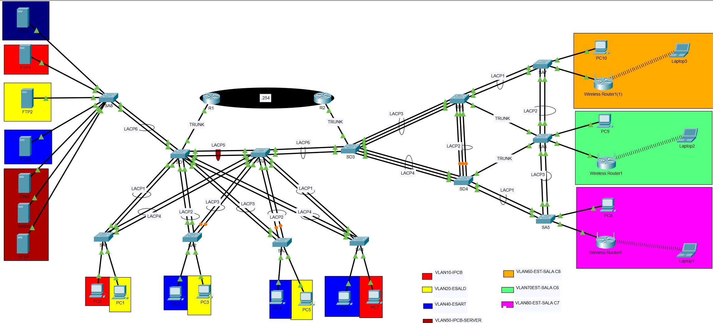

# Rede Campus Empresarial

## Visão Geral
Simulação de uma rede empresarial desenvolvida no Cisco Packet Tracer com foco em segmentação de rede, redundância e tecnologias de switching.

---
## Topologia da Rede

---
## Tecnologias Utilizadas

- VLANs
- Trunking 802.1Q
- EtherChannel (LACP)
- Spanning Tree Protocol (STP)
- HSRP
- DHCP
- Router-on-a-Stick
- Inter-VLAN Routing

---

## Estrutura das VLANs

| VLAN | Nome | Rede |
|------|------|------|
| 10 | IPCB | 192.168.10.0/24 |
| 20 | ESALD | 192.168.20.0/24 |
| 40 | ESART | 192.168.40.0/24 |
| 50 | IPCB-SERVER | 192.168.50.0/24 |
| 60 | EST-SALAC8 | 192.168.60.0/24 |
| 70 | EST-SALAC6 | 192.168.70.0/24 |
| 80 | EST-SALAC7 | 192.168.80.0/24 |

---

## Principais Funcionalidades

- Topologia redundante de switching
- Segmentação utilizando múltiplas VLANs
- Redundância com EtherChannel usando LACP
- Configuração de Root Bridge com STP
- Redundância de gateway com HSRP
- Distribuição dinâmica de IP com DHCP
- Comunicação entre VLANs
- Arquitetura de switching de camada 2

---

## Equipamentos Utilizados

- Switches Cisco
- Routers Cisco
- Cisco Packet Tracer

---

## Objetivo do Projeto

Este projeto foi desenvolvido para simular uma infraestrutura de rede empresarial utilizando tecnologias Cisco e conceitos de switching utilizados em ambientes corporativos.

---

## Autor

Geoveth Vieira  
Estudante de eletrotécnica E Telecomunicações 
